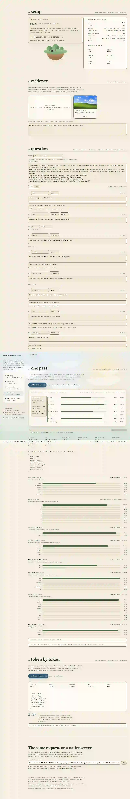

# Momo-S1

**momos-one — multimodal system-1 in your browser.** Give it an image and a finite question; it
answers the whole schema in **one batched forward pass** and returns a probability for every field.
Then it asks the same question token by token, so you can compare the two on your own machine.

No backend, no upload, no API key. The model and the engine both run in the browser.



## Try it in two minutes

Requirements: Chrome or Edge (desktop), Node 18+, a free ~350 MiB of disk for the cached weights.

```bash
npm install
npm run dev
```

Open <http://localhost:5173/>, then:

1. **00 / setup** - press **load the model**. This downloads ~307 MiB
   (`LiquidAI/LFM2.5-VL-450M-GGUF`, model + projector) from Hugging Face. The browser caches it, so
   the next visit loads in seconds. Press **load** once and the page stays ready.
2. **01 / evidence** - drop `samples/bliss.png` (or any image, or paste one). One image becomes one
   context; several images come back as several results in the same pass.
3. **02 / question** - leave the default preset, or pick another from the dropdown.
4. **03 / one pass** - press **run the decision**. You get the assembled JSON, a probability bar per
   field, the numeric interval, and the engine's timing split.
5. **04 / token by token** - press **run token by token** to generate the same answer with a JSON
   grammar and see the measured ratio.

On a 16-core desktop CPU (wasm, no GPU) the run above measured:

| | |
|---|---|
| first decision (cold prefix, image encoded) | **15.9 s** wall · 13.7 s prefill + 2.2 s scoring, 47 scored rows, 640 prompt tokens (72 of them image), 8/8 fields with an exact distribution |
| every later decision (same image and schema) | **4.9 s** wall · the instructions and field catalogue come from the prompt cache (544/640 tokens) and the vision encoder output comes from the media cache |
| generation | **25.3 s** wall, first token 17.9 s, 72 tokens, ~10 t/s |
| ratio | one pass ≈ 1.7× faster than generating the same JSON |

The numbers you see on your machine will be your own: everything is timed with `performance.now()`
and shown as measured. `npm run bench` prints the cold and warm split for three decisions in a row.

## What is actually happening

`llama.cpp`'s server has a `POST /v1/decision` endpoint in this project's fork. Every field of the
schema has a finite set of allowed values; each value is tokenised and scored as a token branch
forked from one shared prefix with `llama_memory_seq_cp`, so all fields are evaluated in **one
batched `llama_decode`** and cannot see each other. The answer is assembled by code, not generated,
and every field comes back with its probability (plus the whole distribution when it was scored
exhaustively). An image is encoded by the vision projector and decoded into the trunk before the
branches fork, so the fields are scored directly on the pixels.

**momos-one does not re-implement that engine.** The wasm build runs the same `handle_decision` as
the native server: `wllama.createDecision(body)` posts a `SERVER_TASK_TYPE_DECISION` task into the
same `server_context` the server uses. Parsing, schema compilation, prompt rendering, tokenisation,
media encoding, branch scoring, aggregation and the error messages are shared code.

The request is the endpoint's own body, so it can be copied straight to a native server:

```ts
const res = await wllama.createDecision({
  instructions: 'kind: the main subject of the image. count: how many…',
  schema: {
    kind: { type: 'enum', choices: ['animal', 'person', 'object'], description: 'the main subject' },
    count: { type: 'integer', minimum: 1, maximum: 9, description: 'how many, capped at 9' },
  },
  contexts: [[
    { type: 'text', text: 'decide from the attached image' },
    { type: 'image_url', image_url: { url: 'data:image/jpeg;base64,…' } },
  ]],
  mode: 'auto',       // auto | tree | greedy
  cache_prompt: true, // reuse the instructions + field catalogue across runs
});
// res.results[i].decision          -> assembled object
// res.results[i].fields[name]      -> value, probability, scored_nodes, tree, candidates, interval
// res.usage / res.timings          -> tokens, scored rows, prefill_ms, scoring_ms, total_ms
```

Section **03** shows both the request and the response JSON, with copy and download buttons.

## Testing it on your own

- **Your own images.** Drop, pick or paste any image. Big photos are downscaled to 512 px and
  re-encoded in the page, and the decision response reports how many tokens the image cost
  (`media_tokens`). Image tokens are what the run costs: a 300×241 sample is 72 tokens, a 980×673
  photo is 176. `?edge=384` (or 256) downscales harder when you want it cheaper.
- **Your own question.** The schema editor is a view over the endpoint's compact field specs
  (`enum`, `boolean`, `integer`, `number`); you can switch to JSON and hand-write it. Numeric fields
  choose their aggregate (mode / median / mean) and report a p10–p90 interval. A preset such as
  "Ticket routing, text only" needs no image at all.
- **Exact vs cheap.** `mode: 'auto'` scores fields exhaustively up to 128 allowed values and walks
  larger ones greedily; the result marks each field `exact distribution` or `greedy walk`. A wide
  schema is grouped into rounds to fit the 12 decision sequences (`rounds` in the timings).
- **Prefix and image reuse.** `cache_prompt: true` reuses the instructions and field catalogue
  between runs (`cached_tokens` in the response), and the engine's media encoder cache reuses the
  vision embeddings of an image it has already seen (`media_cached_tokens`), so changing one field
  and running again costs ~4.9 s instead of ~6.7 s for the sample image. The encoder runs once,
  before the engine starts decoding, so it never contends with an in-flight decode graph.
- **What runs on the GPU.** Load the page with `?log=info` and open the console: llama.cpp prints
  the real split (in a WebGPU browser everything is offloaded — the LLM layers, the KV cache and the
  vision projector — while flash attention and several projector ops are not supported by that
  backend and fall back). On this class of machine the GPU does not speed the vision encoder up.
- **Slow images.** If an image run is slow, look at the split: a large `prefill` on the first run is
  the vision encoder (cached afterwards), a large `scoring` is the schema's width, and `media_tokens`
  tells you how much image the model got. Lower the downscale with `?edge=384` to cut all three.
- **The machine-checked run.** `npm run smoke` drives the whole page in a headless browser,
  loads the model, attaches `samples/bliss.png`, runs both passes and writes
  `e2e/out/summary.json` plus screenshots. It is the same path a person clicks, with no native
  code involved. It uses Edge on Windows and the bundled Chromium elsewhere
  (`npx playwright install chromium` once, or pass `--browser chrome`).
- **The UI run, which needs no model.** `npm run shots` starts its own dev server, screenshots
  every stage at 1280px, 390px and 360px, in the empty state and against a recorded response, and
  writes a report to `e2e/out/ui/`. It measures contrast on the composited pixels of every line of
  text at every scroll position, checks for horizontal overflow, walks the tab order for a visible
  focus ring, and re-checks the reduced-motion composition. `--update-docs` also refreshes the
  three screenshots above (as WebP; it needs ffmpeg on the path).

## Deploy it

`npm run build` writes a static site to `dist/`. Serve it with these two headers and the wasm runs
multithreaded:

```
Cross-Origin-Opener-Policy: same-origin
Cross-Origin-Embedder-Policy: require-corp
```

`npm run preview` serves `dist/` with those headers. Netlify, Vercel, Cloudflare Pages and Hugging
Face Spaces can set them; GitHub Pages cannot, so there the page falls back to a single thread and
still works, just slower.

### Run the built site with no Node

Any static file server works for a quick look. Python only:

```bash
cd dist
python -m http.server 4173
```

Then open <http://localhost:4173/index.html>.

On Windows you can open the browser in the same step:

```cmd
cd /d F:\lab\jev\Momo-S1\dist && start http://localhost:4173/index.html && python -m http.server 4173
```

Do not open `index.html` over `file://`: the wasm build needs HTTP to load. A plain file server does
not send the COOP/COEP headers above, so the engine falls back to a single thread — slower, still
correct. Use `npm run preview` when you want the multithreaded path.

## Honesty about the model

The default is a 450M-parameter vision model. It answers small, well-specified questions
imperfectly, and the page is built to show that instead of hiding it: every field carries its
probability, a probability below 50% is marked **low confidence**, numeric fields carry an interval,
and fields scored by the greedy walk are marked. Read a low probability as a weak answer, not as a
fact. A second, larger model can be added in `src/config.ts` once it has been measured on this
page's parameters.

## Repository layout

```
src/                    the page (React + TypeScript)
  lib/schema.ts         compact field specs <-> JSON Schema, validation
  lib/multimodal.ts     image downscale + re-encode
  lib/runs.ts           the decision and generation calls
  lib/presets.ts        example questions
  lib/motion.ts         the pointer tilt, transform-only and off for reduced motion
  components/Scene.tsx  the painted sky, clouds and ridges behind the instrument
  components/Island.tsx the floating island in the setup stage
  assets/fonts/         Fraunces and Nunito Sans, vendored (see assets/fonts/README.md)
lib/wllama/             the wasm library: fork source + prebuilt wllama.wasm (see PROVENANCE.md)
samples/bliss.png       a small image to try it with
e2e/decision-smoke.mjs  headless end-to-end run (npm run smoke)
e2e/bench-decision.mjs  cold vs warm decision timings (npm run bench)
e2e/ui-shots.mjs        UI screenshots and rendered-contrast checks (npm run shots)
docs/                   plan, spec, implementation report, parity evidence, screenshots
```

## Verification

- `docs/PARITY.md` - the same request posted to a native `llama-server` and to the browser:
  **identical decisions**, every probability within 1.0 pp, identical token accounting
  (`docs/parity-*.json` are the raw bodies).
- `docs/evidence-smoke.json` - the numbers of the last smoke run (timings, tokens, scored rows).
- `e2e/out/ui/summary.json` - the last UI run: every measured text line, the pixel-measured
  contrast ratio and the styled one, layout overflow, focus order and console errors.
- The library's decision API is covered by browser tests in the wllama fork
  (`src/decision.test.ts`): one result per context with every value on-schema, distribution
  consistency, usage/timing accounting, prefix-cache stability, and the error taxonomy.

## Limitations

- Firefox and Safari are not supported in this cut: it ships the memory64 + JSPI build, not the
  asyncify compatibility build.
- The first visit downloads ~307 MiB; after that the browser cache serves it.
- WebGPU is used when the browser has it; the published numbers are CPU-only wasm numbers.
- The wasm engine is roughly an order of magnitude slower than a native CUDA build. The point of
  the page is the method and the comparison, both measured on your machine.

## License and attribution

`lib/wllama` is the MIT-licensed wllama library (see `lib/wllama/LICENCE`); the wasm binary contains
[llama.cpp](https://github.com/ggml-org/llama.cpp) (MIT) with this project's `/v1/decision` engine,
the `candidates` patch and the media encoder cache (see `lib/wllama/PROVENANCE.md`).
Model weights are used under the terms of their Hugging Face repositories
([`LiquidAI/LFM2.5-VL-450M-GGUF`](https://huggingface.co/LiquidAI/LFM2.5-VL-450M-GGUF)).
Type is [Fraunces](https://github.com/undercasetype/Fraunces) and
[Nunito Sans](https://github.com/googlefonts/nunito), both SIL Open Font License 1.1, vendored
into `src/assets/fonts/` so the page still asks for nothing after the weights are cached.

Found a bug? Open an issue in this repository; for the library or the engine, the forks are
[`aakash-chaddha/wllama`](https://github.com/aakash-chaddha/wllama) (the wasm library) and
[`aakash-chaddha/llama.cpp`](https://github.com/aakash-chaddha/llama.cpp) (the engine, a fork of
thecodacus/llama.cpp's parallel-decision work).
